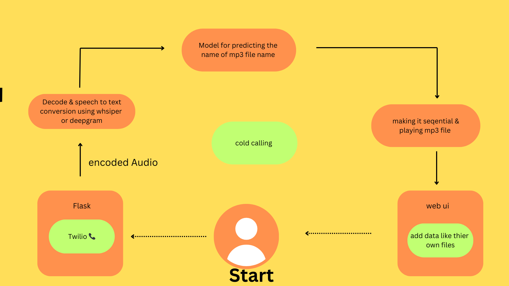

# Cold Calling Assistant Bot 📞🤖
## Pre-orders 📦

We currently have 200 bots pre-ordered. Let’s get started on building this amazing tool!

Welcome to the Cold Calling Assistant Bot project! This bot helps different companies set up their own customized cold-calling assistant. Here’s a simple overview of how to get started and what you need to do today.

## How It Works

1. **Call Setup** 📲
   - Use Twilio (or any other platform) to make calls.
   - Capture the customer's voice in real-time.

2. **Convert Speech to Text** 🗣️➡️📝
   - Use OpenAI Whisper or Deepgram to convert the audio file to text.

3. **Predict and Play MP3 Files** 🎶
   - We are working on a model that predicts the name of the MP3 file to be played during the call.

## Today's Task

1. **Set Up Twilio**:
   - Add a phone number.
   - Start a call using the provided code in `main.py`.
   - Change the number inside the code to the one you added.
   - Get the audio file from the call the code is in main.py file.

2. **Capture and Convert Audio**:
 
   - Convert the audio file from speech to text using OpenAI Whisper or Deepgram.

## Installation and Profit Details

- **Installation Charges**: 1 Lakh per bot.
- **Profit per Company**: $300 - $400.

## Profit Sharing with AB Worldwide 🌐

- **Office and Marketing**: Provided by AB Worldwide (10% shares).
- **Monthly Revenue Example**: If the company makes 16 Lakh per month:
  - 1.6 Lakh to the company.
  - 7.2 Lakh to you.
  - 7.2 Lakh to me.

## Pre-orders 📦

We currently have 200 bots pre-ordered. Let’s get started on building this amazing tool!

---

Feel free to reach out if you have any questions or need further assistance. Happy coding! 🚀
